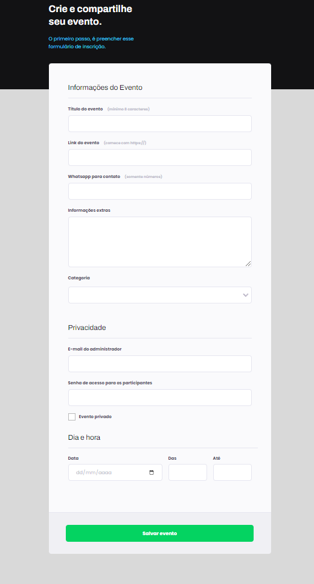

# Projeto 03 - Formulário

> Programa Explorer

Nesse projeto, realizei a construção de um formulário, tentanto utilizar ao máximos os inputs!

[🔗 Clique aqui para acessar](https://kyochi7.github.io/projeto-web-3/)

## 🧰 Tecnologias

- HTML
- CSS
- Github

## 📧 Contato

michigamidaniel77@gmail.com
